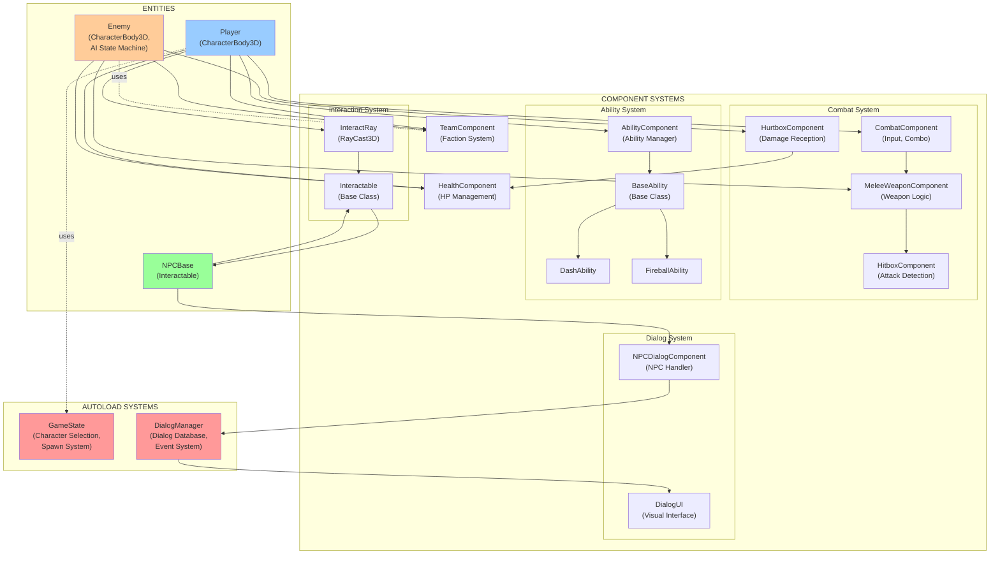
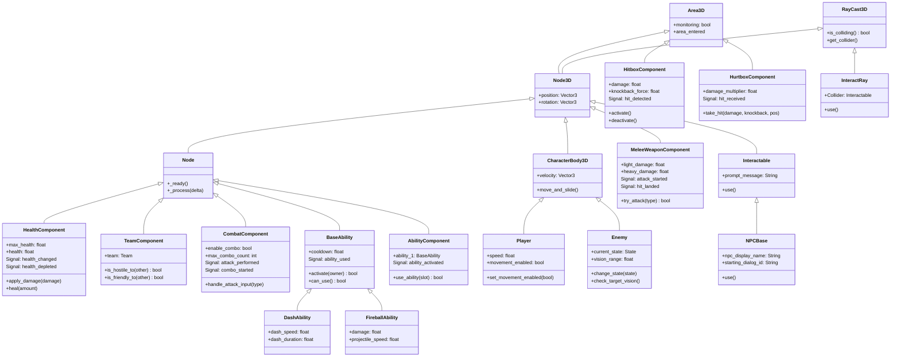
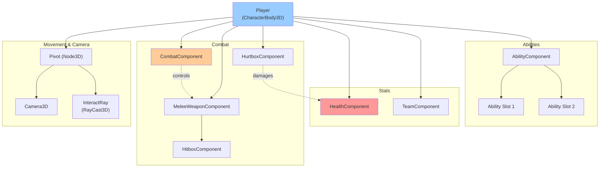
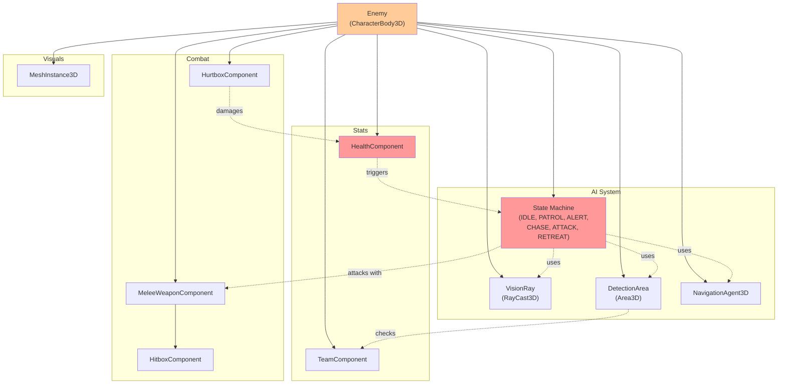
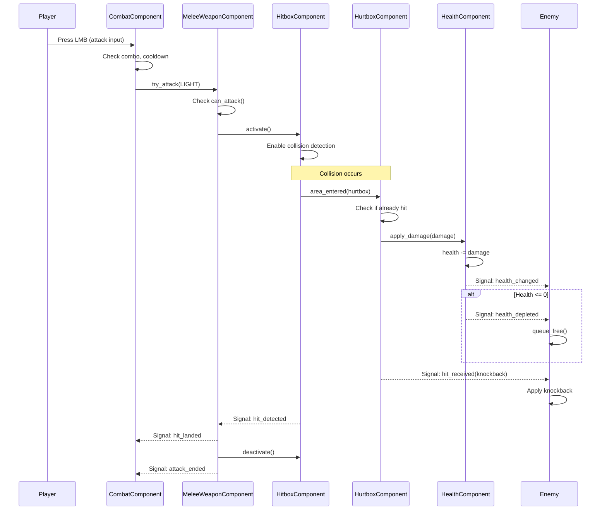
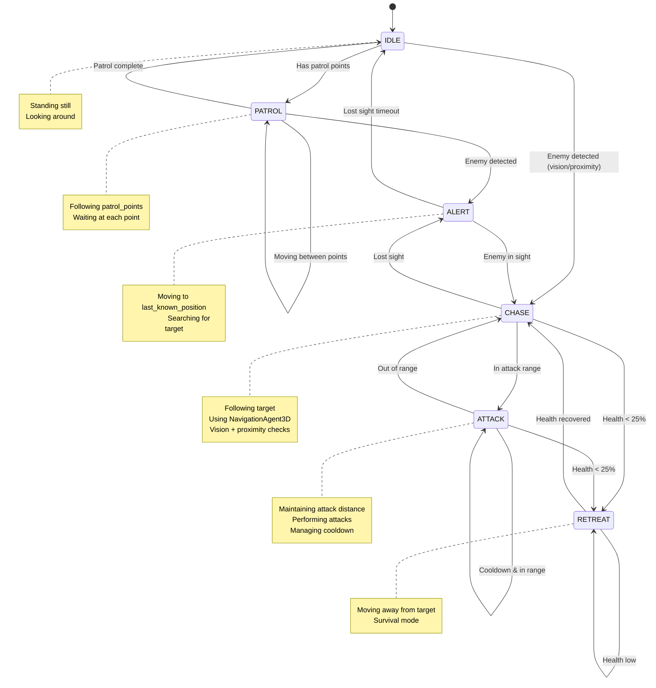
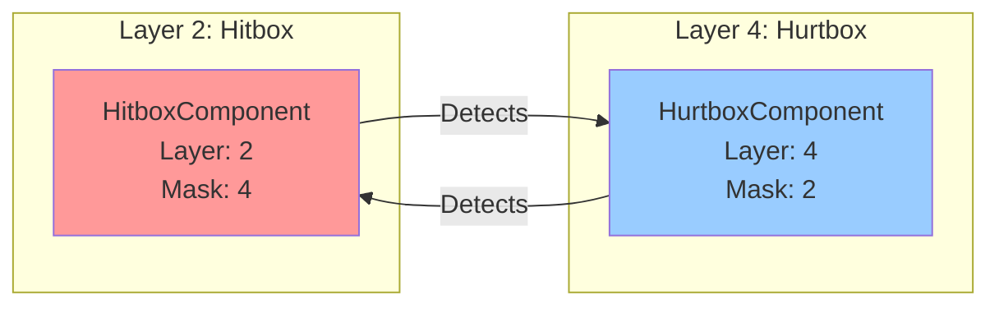
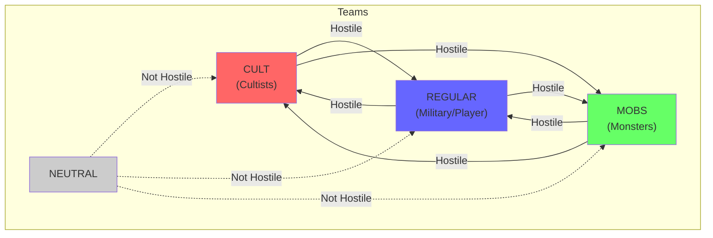

# Game Architecture Diagram / Диаграмма архитектуры игры

## Полная архитектура системы "Hasl" (Godot 4.5)

### 1. Общая архитектура компонентов



---

### 2. Иерархия наследования классов



---

### 3. Структура Player Entity



---

### 4. Структура Enemy Entity



---

### 5. Dialog System Architecture

```mermaid
graph LR
	subgraph "Player Interaction"
		Player["Player"]
		InteractRay["InteractRay"]
	end

	subgraph "NPC"
		NPCBase["NPCBase<br/>(Interactable)"]
		NPCDialog["NPCDialogComponent"]
	end

	subgraph "Dialog System"
		DialogManager["DialogManager<br/>(Autoload)"]
		DialogsJSON["dialogs.json<br/>(Database)"]
		DialogUI["DialogUI<br/>(CanvasLayer)"]
	end

	subgraph "Game Events"
		EventHandlers["Event Handlers<br/>(buy_item, start_quest, etc.)"]
	end

	Player -->|Aims at| NPCBase
	InteractRay -->|Detects| NPCBase
	Player -->|Presses E| NPCBase
	NPCBase -->|use()| NPCDialog
	NPCDialog -->|start_dialog(id)| DialogManager
	DialogManager -->|loads| DialogsJSON
	DialogManager -->|dialog_started| DialogUI
	DialogUI -->|Shows choices| Player
	Player -->|Selects choice| DialogUI
	DialogUI -->|process_choice()| DialogManager
	DialogManager -->|trigger_event()| EventHandlers
	DialogManager -->|dialog_ended| NPCDialog
	NPCDialog -->|Releases control| Player

	style DialogManager fill:#ff9999
	style NPCBase fill:#99ff99
```

---

### 6. Combat Data Flow



---

### 7. Enemy AI State Machine



---

### 8. Collision Layers & Masks



---

### 9. Team System (Faction Hostility Matrix)



---

### 10. Signal Flow Map

```mermaid
graph TB
	subgraph "Health System Signals"
		HC_changed["health_changed<br/>(current, max, damaged)"]
		HC_depleted["health_depleted()"]
	end

	subgraph "Combat System Signals"
		CC_attack["attack_performed<br/>(attack_type)"]
		CC_combo["combo_started<br/>(combo_index)"]
		MW_started["attack_started<br/>(attack_type)"]
		MW_ended["attack_ended()"]
		MW_hit["hit_landed<br/>(target)"]
		HB_detected["hit_detected<br/>(hurtbox)"]
		HT_received["hit_received<br/>(damage, knockback, pos)"]
	end

	subgraph "Dialog System Signals"
		DM_started["dialog_started<br/>(dialog_id)"]
		DM_ended["dialog_ended()"]
		DM_event["dialog_event<br/>(event_name, params)"]
	end

	subgraph "Ability System Signals"
		AB_used["ability_used<br/>(ability_name)"]
		AB_ready["ability_ready<br/>(ability_name)"]
		AC_activated["ability_activated<br/>(ability_name)"]
	end

	HC_changed -->|Player/Enemy| UI["UI Updates"]
	HC_depleted -->|Entity| Death["Entity Death"]

	CC_attack -->|Player| AnimSystem["Animation System"]
	MW_hit -->|Weapon| VFX["VFX/SFX"]
	HT_received -->|Enemy| AIReaction["AI Reaction"]

	DM_started -->|DialogUI| ShowDialog["Show Dialog Panel"]
	DM_ended -->|NPCDialog| ReleasePlayer["Release Player Control"]

	AB_used -->|UI| CooldownUI["Cooldown Display"]

	style HC_depleted fill:#ff6666
	style DM_started fill:#66ff66
```



---

## Легенда

- **Прямоугольники** - Компоненты/Системы
- **Ромбы** - Точки принятия решений
- **Стрелки →** - Прямые зависимости
- **Пунктирные стрелки -.->** - Использование/Ссылки
- **Цвета:**
  - 🔴 Красный - Autoload/Критичные системы
  - 🔵 Синий - Player
  - 🟠 Оранжевый - Enemy
  - 🟢 Зеленый - NPC
