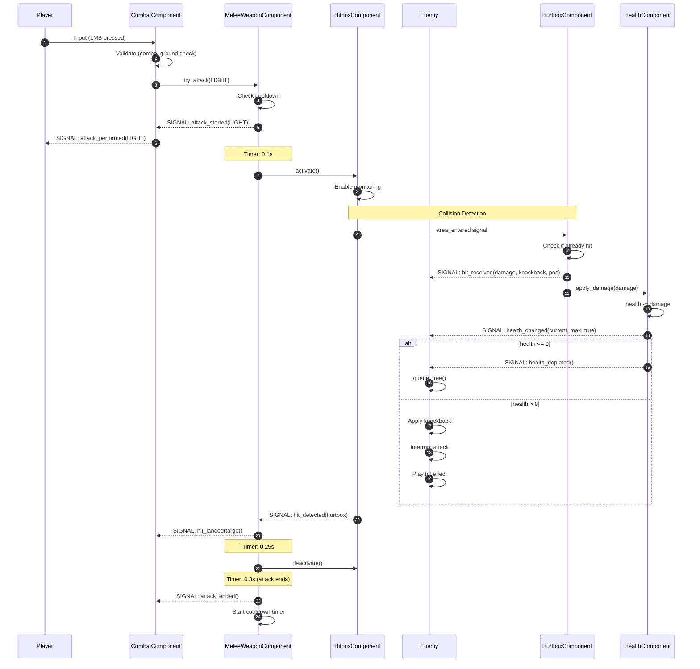

# Combat System Flow / Детальный поток боевой системы

## Полный цикл атаки от ввода до нанесения урона

### 1. Combat Flow - Complete Attack Cycle

---

### 2. Combo System Flow

---

### 3. Attack Timing Diagram

**Параметры из примера:**
- `light_attack_duration = 0.3s` (300ms)
- `light_active_start = 0.1s` (100ms)
- `light_active_end = 0.25s` (250ms)
- `light_cooldown = 0.4s` (400ms)

**Фазы:**
1. **Startup (0 - 100ms)**: Анимация начинается, урон не наносится
2. **Active (100 - 250ms)**: Хитбокс активен, может нанести урон
3. **Recovery (250 - 300ms)**: Анимация завершается, урон не наносится
4. **Cooldown (300 - 700ms)**: Невозможно атаковать снова

---

### 4. Signal Propagation in Combat

---

### 5. Hit Detection Logic

---

### 6. Damage Multiplier System

---

### 7. Attack Interruption Flow

---

### 8. Combat Component State Management

---

### 9. Collision Layer Interaction

**Правила:**
- **Layer 2 (Hitbox)** может обнаружить **Layer 4 (Hurtbox)**
- **Layer 4 (Hurtbox)** может обнаружить **Layer 2 (Hitbox)**
- Hitbox игрока НЕ видит Hitbox врага (нет столкновения оружия)
- Hurtbox игрока НЕ видит Hurtbox врага (нет столкновения тел)

---

### 10. Performance Optimization Notes

**Оптимизации в боевой системе:**

1. **Hit Prevention**:
   - `hit_targets: Array` предотвращает множественные попадания
   - Очищается при каждой новой атаке

2. **Hitbox Activation**:
   - Hitbox активен только во время active window (100-150ms обычно)
   - Отключен в остальное время

3. **Cooldown System**:
   - Предотвращает spam атак
   - Балансировка геймплея

4. **Signal-based**:
   - Слабая связанность компонентов
   - Легко добавлять новые реакции (VFX, SFX, анимации)

5. **Component Separation**:
   - CombatComponent = логика ввода/комбо
   - MeleeWeaponComponent = логика оружия
   - Легко менять оружие без изменения боевой системы
