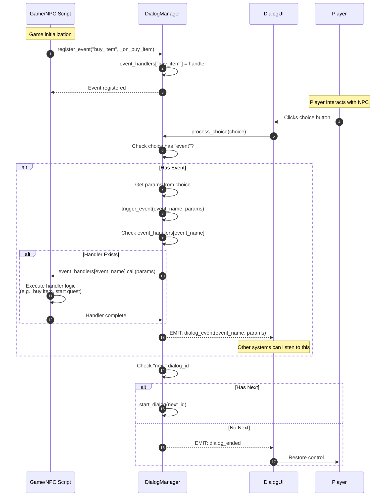
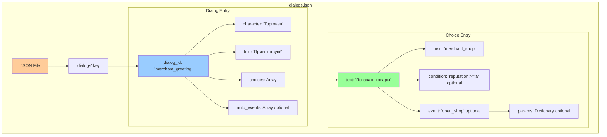
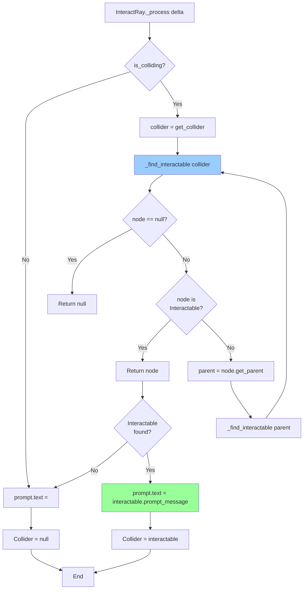
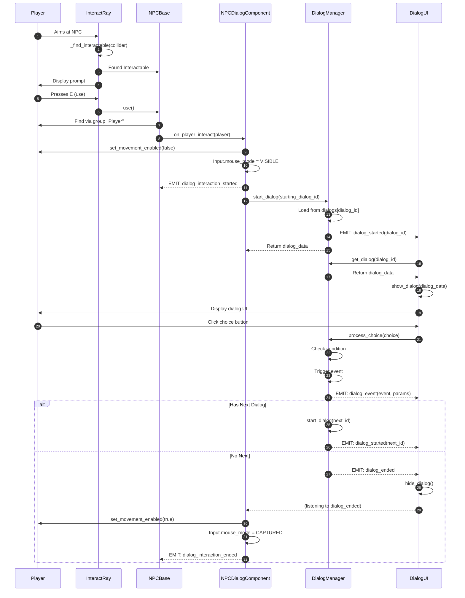
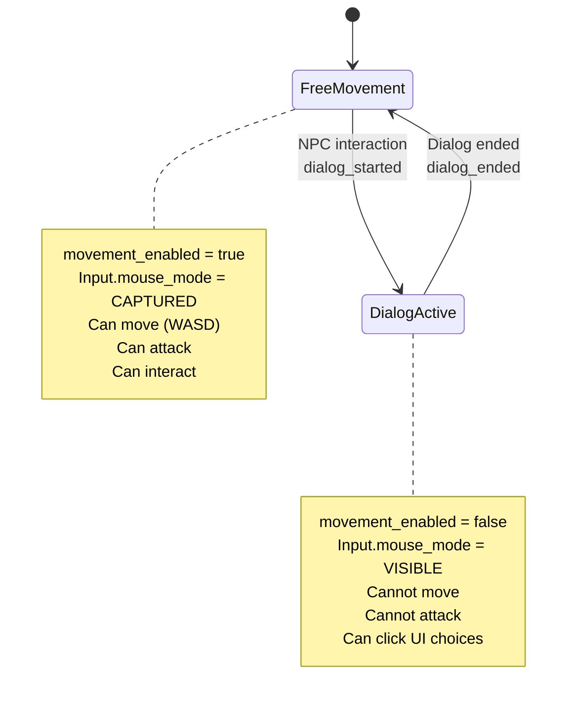
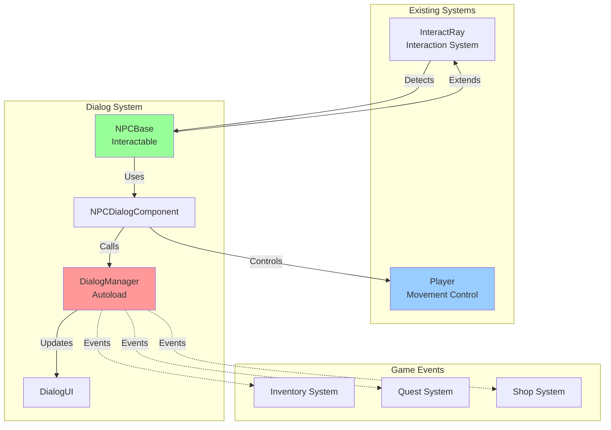
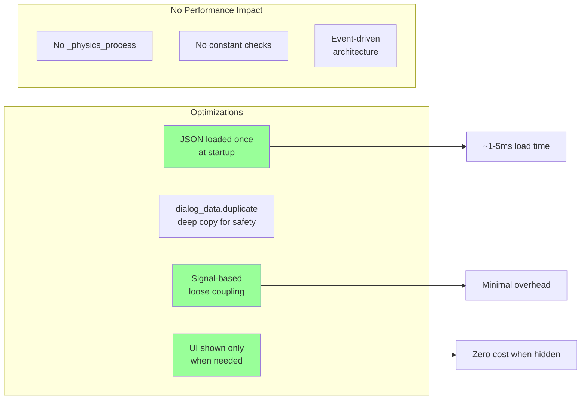

# Dialog System Flow / Диаграмма потока диалоговой системы

## Полный цикл диалога от взаимодействия до завершения

### 1. Complete Dialog Flow

```mermaid
flowchart TD
    Start([Player approaches NPC]) --> RayActive[InteractRay._process active]

    RayActive --> Collision{RayCast<br/>colliding?}
    Collision -->|No| NoPrompt[prompt.text = ""]
    Collision -->|Yes| GetCollider[collider = get_collider]

    GetCollider --> FindInteractable[_find_interactable collider]
    FindInteractable --> CheckType{Is Interactable?}

    CheckType -->|No| CheckParent{Check parent<br/>recursively}
    CheckParent -->|Found| DisplayPrompt
    CheckParent -->|Not Found| NoPrompt

    CheckType -->|Yes| DisplayPrompt[prompt.text = interactable.prompt_message]

    DisplayPrompt --> WaitInput{Player presses E?}
    WaitInput -->|No| RayActive
    WaitInput -->|Yes| CallUse[InteractRay.use]

    CallUse --> NPCUse[NPCBase.use]
    NPCUse --> FindPlayer[Find player via group 'Player']
    FindPlayer --> CheckDialog{Has dialog_component?}

    CheckDialog -->|No| Error[Push error: Component not found]
    CheckDialog -->|Yes| InteractCall[dialog_component.on_player_interact player]

    InteractCall --> CheckInDialog{Already in<br/>dialog?}
    CheckInDialog -->|Yes| Ignore[Ignore interaction]
    CheckInDialog -->|No| SetDialogState[is_in_dialog = true]

    SetDialogState --> SavePlayer[player_reference = player]
    SavePlayer --> BlockMovement[player.set_movement_enabled false]
    BlockMovement --> ReleaseMouse[Input.mouse_mode = VISIBLE]
    ReleaseMouse --> EmitStart[EMIT: dialog_interaction_started]

    EmitStart --> GetDialogID[Get starting_dialog_id or greeting_dialog_id]
    GetDialogID --> ManagerStart[DialogManager.start_dialog dialog_id]

    ManagerStart --> CheckExists{Dialog exists<br/>in database?}
    CheckExists -->|No| PushError[Push error: Dialog not found]
    CheckExists -->|Yes| LoadDialog[current_dialog = dialogs[dialog_id]]

    LoadDialog --> DuplicateData[Duplicate dialog data deep copy]
    DuplicateData --> EmitDialogStarted[EMIT: dialog_started dialog_id]
    EmitDialogStarted --> CheckAutoEvents{Has auto_events?}

    CheckAutoEvents -->|Yes| TriggerAutoEvents[For each event: trigger_event]
    CheckAutoEvents -->|No| ReturnData
    TriggerAutoEvents --> ReturnData[Return dialog data]

    ReturnData --> UIListen[DialogUI._on_dialog_started]
    UIListen --> GetDialogData[DialogManager.get_dialog dialog_id]
    GetDialogData --> ShowUI[show_dialog dialog_data]

    ShowUI --> SetCharName[CharacterName.text = dialog_data.character]
    SetCharName --> SetDialogText[DialogText.text = dialog_data.text]
    SetDialogText --> ClearChoices[Clear old choice buttons]

    ClearChoices --> HasChoices{Has choices<br/>array?}
    HasChoices -->|No| CreateContinue[Create 'Продолжить' button]
    HasChoices -->|Yes| LoopChoices[For each choice]

    CreateContinue --> CreateButton1
    LoopChoices --> CreateButton1[create_choice_button choice]

    CreateButton1 --> NewButton[Button.new]
    NewButton --> SetButtonText[button.text = choice.text]
    SetButtonText --> CheckCondition{Has condition?}

    CheckCondition -->|Yes| EvalCondition[DialogManager.check_condition]
    EvalCondition --> ConditionResult{Condition<br/>passed?}
    ConditionResult -->|No| DisableButton[button.disabled = true<br/>button.text += ' [Недоступно]']
    ConditionResult -->|Yes| ConnectSignal

    CheckCondition -->|No| ConnectSignal[button.pressed.connect _on_choice_pressed.bind choice]
    DisableButton --> ConnectSignal

    ConnectSignal --> AddButton[choices_container.add_child button]
    AddButton --> ShowPanel[dialog_panel.show]
    ShowPanel --> WaitChoice{Player clicks<br/>button?}

    WaitChoice --> ChoicePressed[_on_choice_pressed choice]
    ChoicePressed --> ProcessChoice[DialogManager.process_choice choice]

    ProcessChoice --> CheckChoiceCondition{Choice has<br/>condition?}
    CheckChoiceCondition -->|Yes| ValidateCondition[check_condition]
    ValidateCondition --> PassedCondition{Passed?}
    PassedCondition -->|No| ReturnEmpty[Return empty dict]

    CheckChoiceCondition -->|No| CheckEvent
    PassedCondition -->|Yes| CheckEvent{Has event?}

    CheckEvent -->|Yes| GetParams[params = choice.get 'params', {}]
    GetParams --> TriggerEvent[trigger_event event, params]
    TriggerEvent --> EmitEvent[EMIT: dialog_event event_name, params]
    EmitEvent --> CheckHandlers{Has registered<br/>event_handlers?}

    CheckHandlers -->|Yes| CallHandlers[event_handlers[event_name].call params]
    CheckHandlers -->|No| EventHandled

    CallHandlers --> EventHandled[Event processed]
    EventHandled --> CheckNext{Has 'next'<br/>dialog_id?}

    CheckEvent -->|No| CheckNext

    CheckNext -->|Yes & not null| RecursiveStart[start_dialog choice.next]
    RecursiveStart --> ManagerStart

    CheckNext -->|No or null| EndDialog[EMIT: dialog_ended]
    ReturnEmpty --> EndDialog

    EndDialog --> UIHide[DialogUI._on_dialog_ended]
    UIHide --> HidePanel[hide_dialog]
    HidePanel --> SetInactive[is_active = false]
    SetInactive --> PanelHide[dialog_panel.hide]

    PanelHide --> NPCEnd[NPCDialogComponent._on_dialog_ended]
    NPCEnd --> CheckStillInDialog{is_in_dialog?}
    CheckStillInDialog -->|No| AlreadyEnded[Already ended]
    CheckStillInDialog -->|Yes| SetNotInDialog[is_in_dialog = false]

    SetNotInDialog --> EmitInteractionEnd[EMIT: dialog_interaction_ended]
    EmitInteractionEnd --> CheckPlayerRef{player_reference<br/>exists?}

    CheckPlayerRef -->|No| RestoreMouse
    CheckPlayerRef -->|Yes| RestoreMovement[player.set_movement_enabled true]

    RestoreMovement --> RestoreMouse[Input.mouse_mode = CAPTURED]
    RestoreMouse --> End([Dialog Complete])

    Error --> End
    Ignore --> End
    PushError --> End
    AlreadyEnded --> End

    style Start fill:#99ccff
    style End fill:#99ff99
    style BlockMovement fill:#ffcc99
    style RestoreMovement fill:#99ff99
    style EndDialog fill:#ff9999
```

---

### 2. Condition System Flow

```mermaid
flowchart TD
    CheckCond[check_condition condition_string] --> SplitString[Split by ':']

    SplitString --> CountParts{parts.size?}

    CountParts -->|2| TwoPartFormat["Format: 'type:value'"]
    CountParts -->|3| ThreePartFormat["Format: 'variable:operator:value'"]
    CountParts -->|Other| ReturnTrue1[Return true default]

    TwoPartFormat --> GetType[type = parts[0]]
    GetType --> GetValue1[value = parts[1]]
    GetValue1 --> MatchType{Match type}

    MatchType -->|has_item| CheckItem[check_has_item value]
    MatchType -->|quest_active| CheckQuest[check_quest_active value]
    MatchType -->|Other| ReturnTrue2[Return true]

    CheckItem --> ItemResult{Has item?}
    ItemResult -->|Yes| ReturnTrue3[Return true]
    ItemResult -->|No| ReturnFalse1[Return false]

    CheckQuest --> QuestResult{Quest active?}
    QuestResult -->|Yes| ReturnTrue4[Return true]
    QuestResult -->|No| ReturnFalse2[Return false]

    ThreePartFormat --> GetVariable[variable = parts[0]]
    GetVariable --> GetOperator[operator = parts[1]]
    GetOperator --> GetValue2[value = parts[2].to_float]

    GetValue2 --> GetPlayerVar[player_value = get_player_variable variable]
    GetPlayerVar --> MatchOperator{Match operator}

    MatchOperator -->|">"| Greater[player_value > value]
    MatchOperator -->|"<"| Less[player_value < value]
    MatchOperator -->|">="| GreaterEqual[player_value >= value]
    MatchOperator -->|"<="| LessEqual[player_value <= value]
    MatchOperator -->|"=="| Equal[player_value == value]

    Greater --> ReturnResult1[Return comparison result]
    Less --> ReturnResult1
    GreaterEqual --> ReturnResult1
    LessEqual --> ReturnResult1
    Equal --> ReturnResult1

    ReturnResult1 --> End1[End]
    ReturnTrue1 --> End1
    ReturnTrue2 --> End1
    ReturnTrue3 --> End1
    ReturnTrue4 --> End1
    ReturnFalse1 --> End1
    ReturnFalse2 --> End1

    style CheckCond fill:#99ccff
    style ReturnTrue3 fill:#99ff99
    style ReturnFalse1 fill:#ff9999
```

**Примеры условий:**
- `"has_item:key"` → проверка наличия ключа в инвентаре
- `"quest_active:main_quest_1"` → проверка активности квеста
- `"reputation:>=:10"` → проверка репутации >= 10
- `"level:>:5"` → проверка уровня > 5
- `"gold:>=:100"` → проверка золота >= 100

---

### 3. Event System Flow



---

### 4. Dialog JSON Structure Flow



**Пример JSON:**
```json
{
  "dialogs": {
    "merchant_greeting": {
      "character": "Торговец",
      "text": "Приветствую, путник!",
      "choices": [
        {
          "text": "Показать товары",
          "next": "merchant_shop",
          "event": "open_shop"
        },
        {
          "text": "Есть работа?",
          "next": "merchant_quest",
          "condition": "reputation:>=:5"
        },
        {
          "text": "Прощай",
          "next": null
        }
      ]
    }
  }
}
```

---

### 5. Interaction Detection Flow



**Поиск Interactable вверх по иерархии:**
```
StaticBody3D (collider)
    ↓ get_parent()
NPCBase (extends Interactable) ← FOUND!
```

---

### 6. Signal Flow Diagram



---

### 7. Player Control State Machine



---

### 8. Choice Button Creation Flow

```mermaid
flowchart TD
    CreateButton[create_choice_button choice] --> NewBtn[button = Button.new]

    NewBtn --> SetText[button.text = choice.get 'text', '???']
    SetText --> SetSize[button.custom_minimum_size = Vector2 0, 40]
    SetSize --> CheckCond{choice has<br/>'condition'?}

    CheckCond -->|No| ConnectPressed
    CheckCond -->|Yes| CallCheck[DialogManager.check_condition choice.condition]

    CallCheck --> CondPassed{Passed?}
    CondPassed -->|Yes| ConnectPressed
    CondPassed -->|No| DisableBtn[button.disabled = true]

    DisableBtn --> AppendText[button.text += ' [Недоступно]']
    AppendText --> ConnectPressed[button.pressed.connect _on_choice_pressed.bind choice]

    ConnectPressed --> AddChild[choices_container.add_child button]
    AddChild --> End[Button ready]

    style NewBtn fill:#99ccff
    style DisableBtn fill:#ff9999
    style AddChild fill:#99ff99
```

---

### 9. Dialog Database Loading

```mermaid
flowchart TD
    Ready[DialogManager._ready] --> Call[load_dialogs]

    Call --> Path[file_path = 'res://components/DialogoeSystem/dialogs.json']
    Path --> Exists{FileAccess.file_exists<br/>file_path?}

    Exists -->|No| PrintError1[print 'File not Found']
    Exists -->|Yes| OpenFile[file = FileAccess.open file_path, READ]

    OpenFile --> CheckFile{file == null?}
    CheckFile -->|Yes| PushError1[push_error 'Failed to open file']
    CheckFile -->|No| CreateJSON[json = JSON.new]

    CreateJSON --> Parse[error = json.parse file.get_as_text]
    Parse --> CloseFile[file.close]
    CloseFile --> CheckError{error == OK?}

    CheckError -->|No| PushError2[push_error 'JSON parse error']
    CheckError -->|Yes| GetData[data = json.data]

    GetData --> HasDialogs{data.has 'dialogs'?}
    HasDialogs -->|No| PushError3[push_error 'Invalid file structure']
    HasDialogs -->|Yes| AssignDialogs[dialogs = data['dialogs']]

    AssignDialogs --> PrintSuccess[print 'Dialogs loaded successfully: X dialogs']
    PrintSuccess --> End[Ready to use]

    PrintError1 --> End
    PushError1 --> End
    PushError2 --> End
    PushError3 --> End

    style AssignDialogs fill:#99ff99
    style PushError2 fill:#ff9999
    style PushError3 fill:#ff9999
```

---

### 10. Integration with Existing Systems



**Интеграция:**
1. **InteractRay** уже работает с `Interactable`
2. **NPCBase** наследует `Interactable` → автоматическая совместимость
3. **DialogManager** как Autoload → доступен глобально
4. **События** позволяют интегрироваться с любыми системами

---

### 11. Performance Considerations



**Метрики:**
- Загрузка JSON: ~1-5ms (один раз при старте)
- Открытие диалога: <1ms
- Создание кнопок: <1ms на кнопку
- Память: ~50KB для 20-30 диалогов
- FPS impact: 0 (event-driven, не использует _process когда неактивен)
