# Enemy AI System Diagram / Диаграмма AI системы врагов

## Подробная архитектура AI врага с State Machine

### 1. Complete Enemy AI State Machine

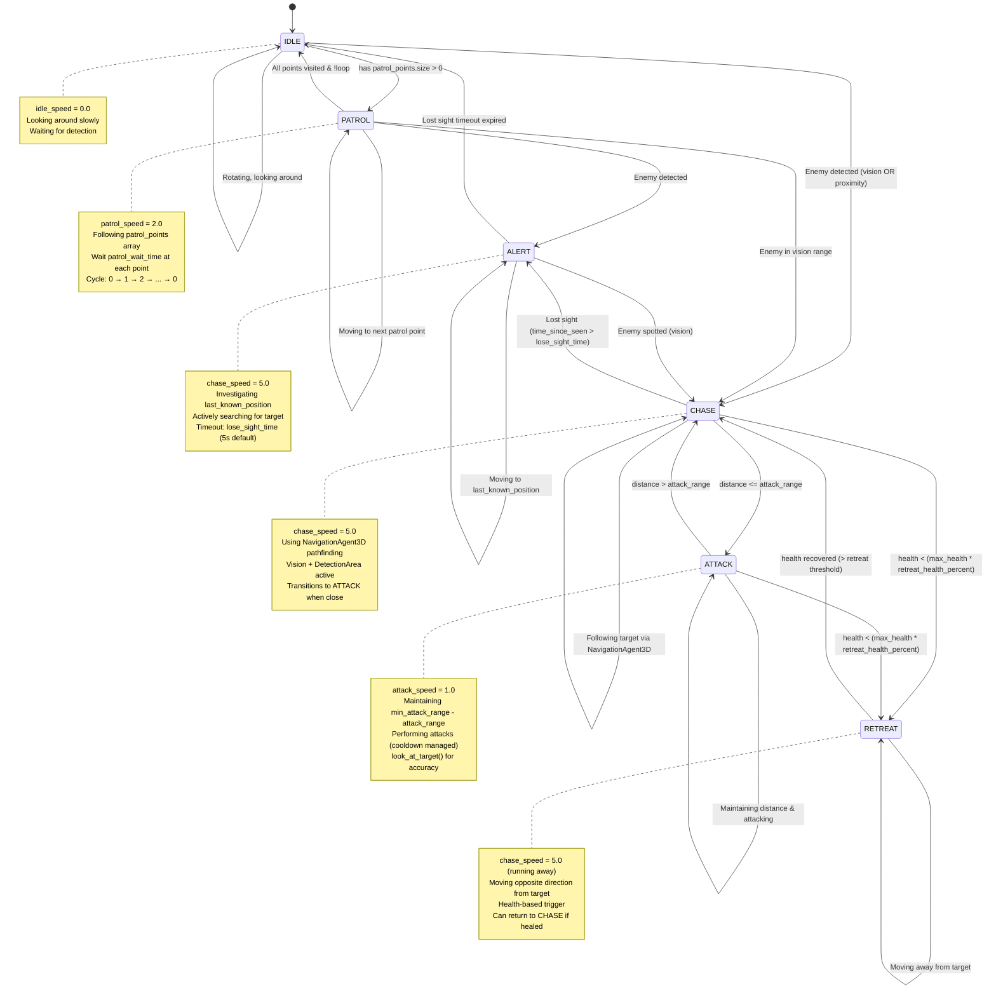

---

### 2. Enemy AI Update Loop

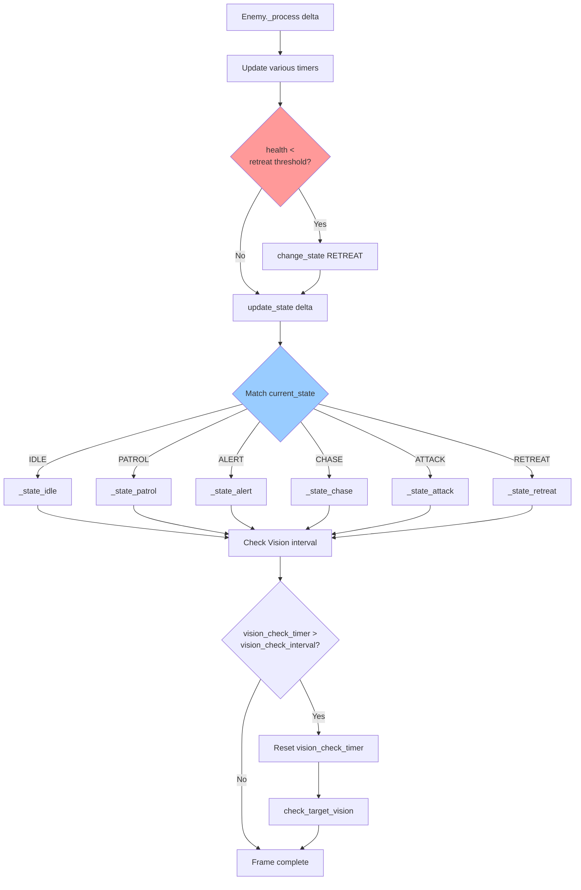

---

### 3. Vision System Detailed Flow

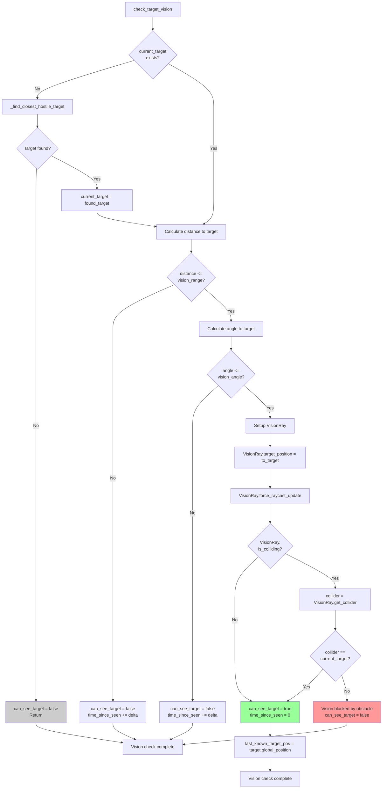

**Параметры Vision:**
- `vision_range: float = 15.0` - дистанция зрения
- `vision_angle: float = 90.0` - угол обзора (degrees)
- `vision_check_interval: float = 0.1` - частота проверки

---

### 4. Target Detection System

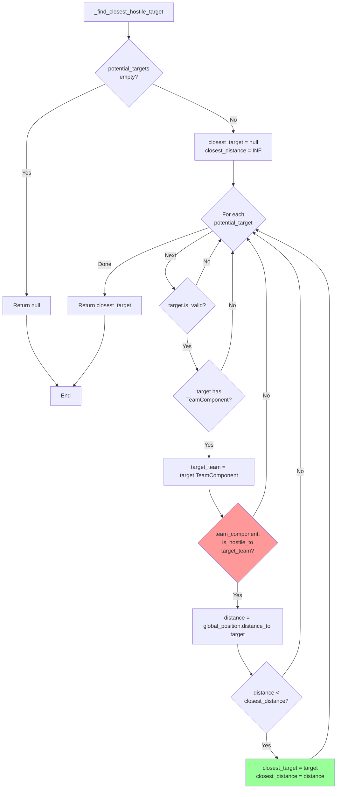

---

### 5. Detection Area Integration

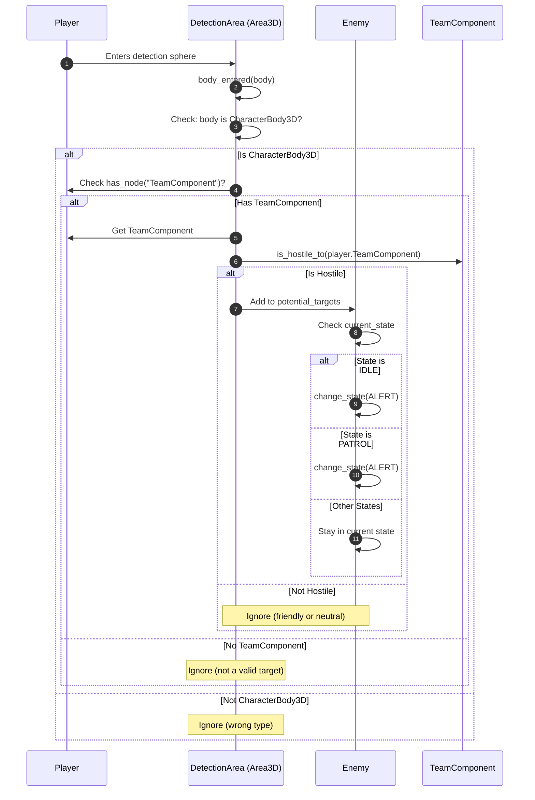

**DetectionArea настройка:**
- Shape: SphereShape3D
- Radius: `detection_radius` (20.0 default)
- Monitoring: true
- Signals: `body_entered`, `body_exited`

---

### 6. Navigation System Flow

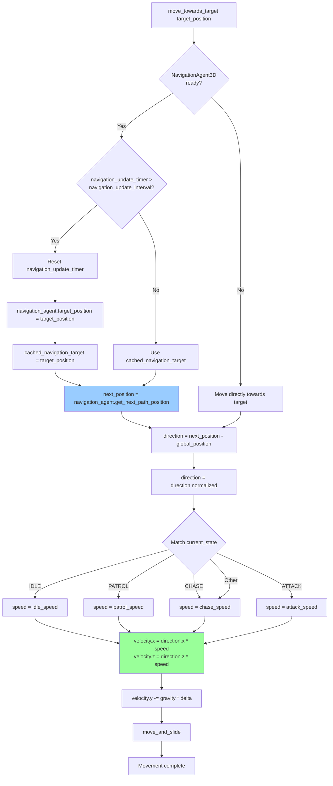

**Оптимизация Navigation:**
- `navigation_update_interval: float = 0.2` - не пересчитываем путь каждый кадр
- `cached_navigation_target` - используем кеш между обновлениями

---

### 7. State-Specific Behaviors

#### IDLE State
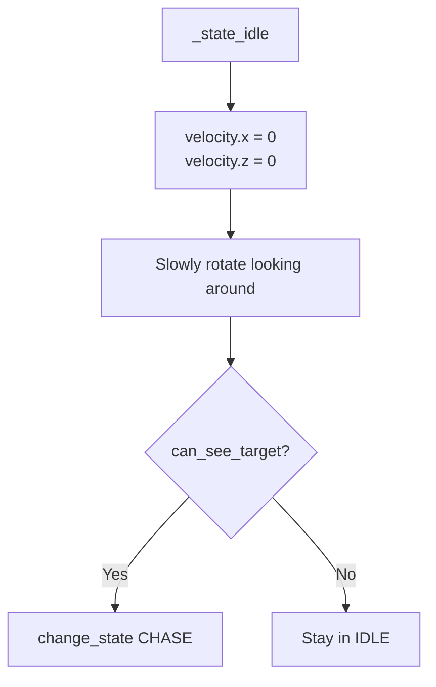

#### PATROL State
```mermaid
flowchart TD
    Patrol[_state_patrol] --> HasPoints{patrol_points.<br/>size > 0?}
    HasPoints -->|No| ToIdle[change_state IDLE]
    HasPoints -->|Yes| GetPoint[current_point = patrol_points[patrol_index]]

    GetPoint --> CalcDist[distance = global_position.distance_to current_point]
    CalcDist --> Reached{distance < 1.0?}

    Reached -->|No| MoveToPoint[move_towards_target current_point]
    Reached -->|Yes| StartWait[patrol_wait_timer = patrol_wait_time]

    StartWait --> Waiting{patrol_wait_timer<br/>> 0?}
    Waiting -->|Yes| Decrement[patrol_wait_timer -= delta]
    Waiting -->|No| NextIndex[patrol_index = patrol_index + 1 % patrol_points.size]

    NextIndex --> GetPoint
    Decrement --> CheckVision
    MoveToPoint --> CheckVision{can_see_target?}

    CheckVision -->|Yes| ToChase[change_state CHASE]
    CheckVision -->|No| End[Continue PATROL]
```

#### CHASE State
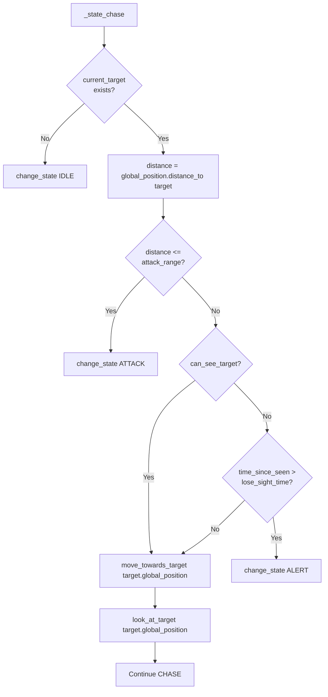

#### ATTACK State
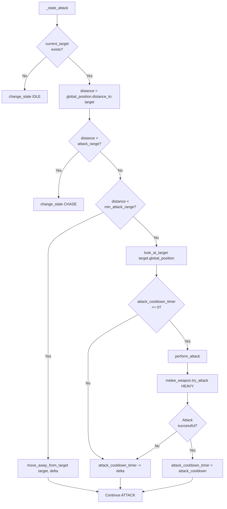

#### RETREAT State
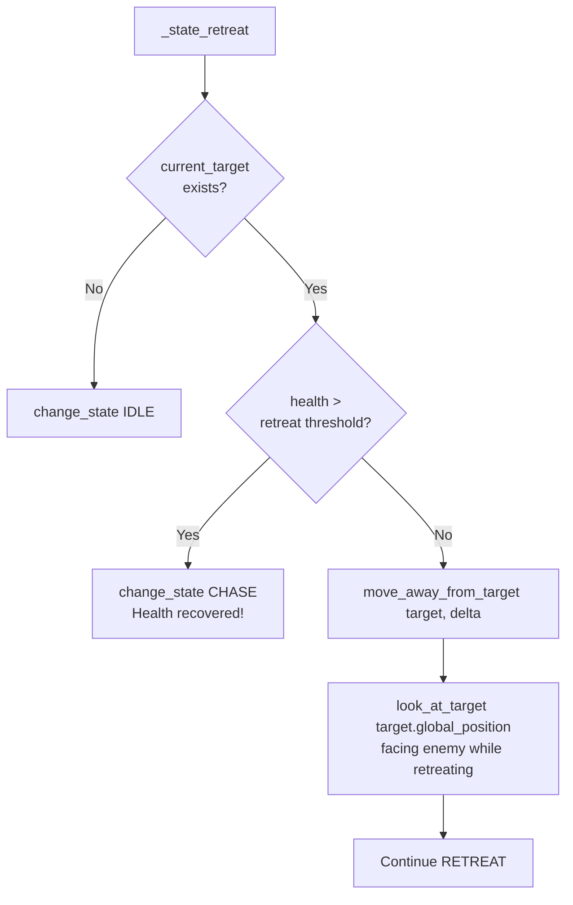

---

### 8. Damage Reaction Flow

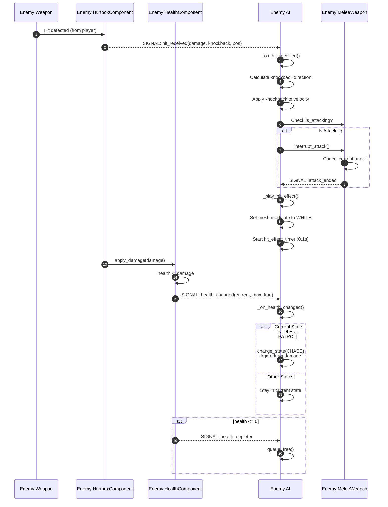

**Hit Effect:**
- Mesh modulate → Color.WHITE (flash)
- Duration: 0.1s
- Returns to normal color (RED)

---

### 9. Team-Based Target Selection

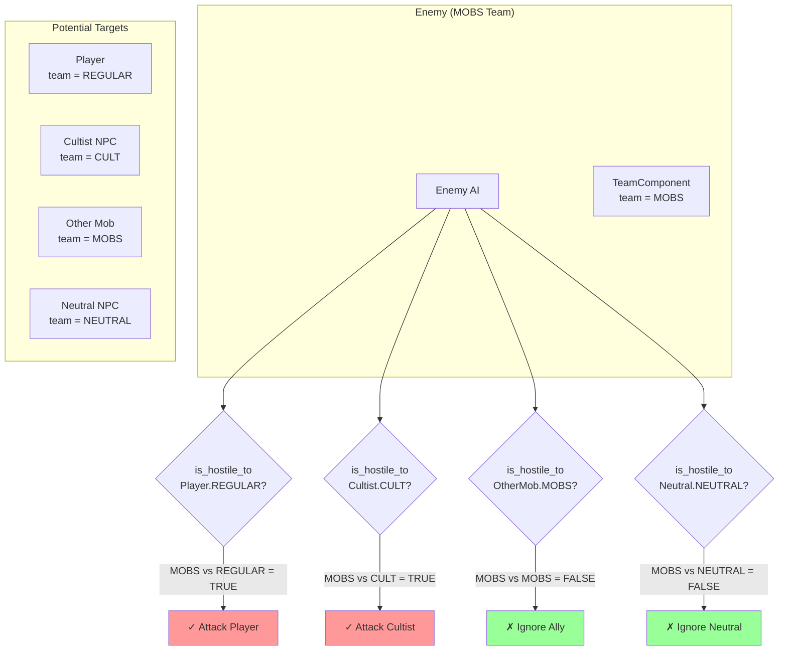

**Hostility Matrix:**
```
        | CULT | REGULAR | MOBS | NEUTRAL |
--------|------|---------|------|---------|
CULT    | ✗    | ✓       | ✓    | ✗       |
REGULAR | ✓    | ✗       | ✓    | ✗       |
MOBS    | ✓    | ✓       | ✗    | ✗       |
NEUTRAL | ✗    | ✗       | ✗    | ✗       |
```

---

### 10. Performance Optimization

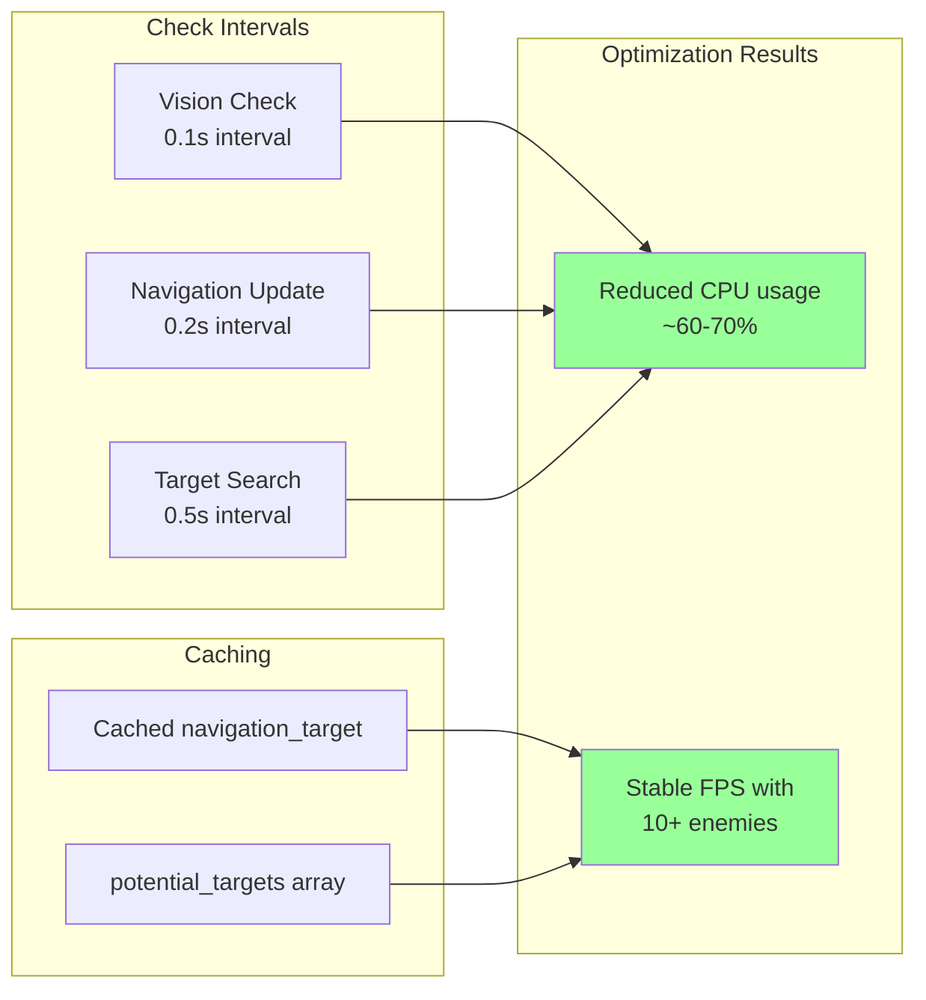

**Оптимизации:**
1. Vision check не каждый кадр (0.1s interval)
2. Navigation path не пересчитывается каждый кадр (0.2s interval)
3. Target search с интервалом (0.5s interval)
4. Кеширование navigation target
5. potential_targets обновляется только при входе/выходе из DetectionArea
6. Debug prints отключены по умолчанию (`enable_debug_prints = false`)

---

### 11. AI State Transition Triggers

```mermaid
graph TB
    subgraph "Detection Triggers"
        VisionDetect[Vision Detection<br/>can_see_target = true]
        ProximityDetect[Proximity Detection<br/>body_entered DetectionArea]
        DamageDetect[Damage Received<br/>hit_received signal]
    end

    subgraph "Distance Triggers"
        InAttackRange[Distance <= attack_range]
        OutAttackRange[Distance > attack_range]
        TooClose[Distance < min_attack_range]
    end

    subgraph "Time Triggers"
        LostSight[time_since_seen > lose_sight_time]
        WaitComplete[patrol_wait_timer <= 0]
        CooldownReady[attack_cooldown_timer <= 0]
    end

    subgraph "Health Triggers"
        LowHealth[health < max_health * retreat_percent]
        HealthRecovered[health > retreat threshold]
        Death[health <= 0]
    end

    VisionDetect --> Chase[→ CHASE]
    ProximityDetect --> Alert[→ ALERT]
    DamageDetect --> Chase

    InAttackRange --> Attack[→ ATTACK]
    OutAttackRange --> Chase
    TooClose --> MoveBack[Move Backward]

    LostSight --> Alert
    WaitComplete --> NextPatrol[Next Patrol Point]
    CooldownReady --> PerformAttack[Perform Attack]

    LowHealth --> Retreat[→ RETREAT]
    HealthRecovered --> Chase
    Death --> Destroy[queue_free]

    style Chase fill:#ff9999
    style Attack fill:#ff9999
    style Retreat fill:#ffcc99
    style Destroy fill:#666666
```

---

### 12. Complete AI Decision Tree

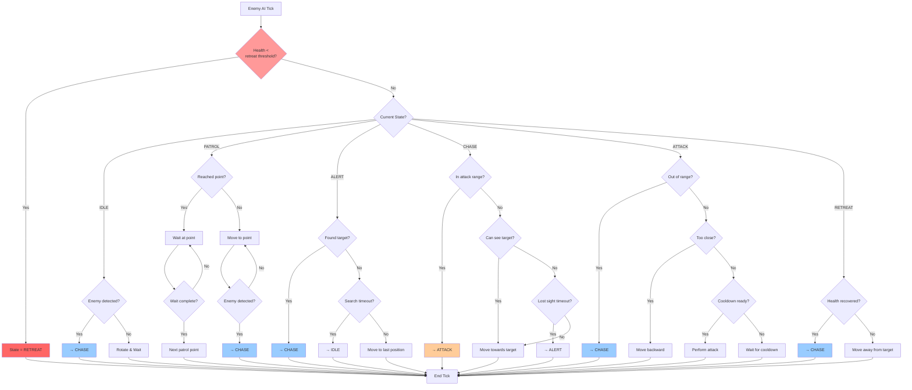

---

Эта диаграмма показывает полную логику AI врага с учетом всех состояний, переходов, оптимизаций и интеграций с другими системами.
